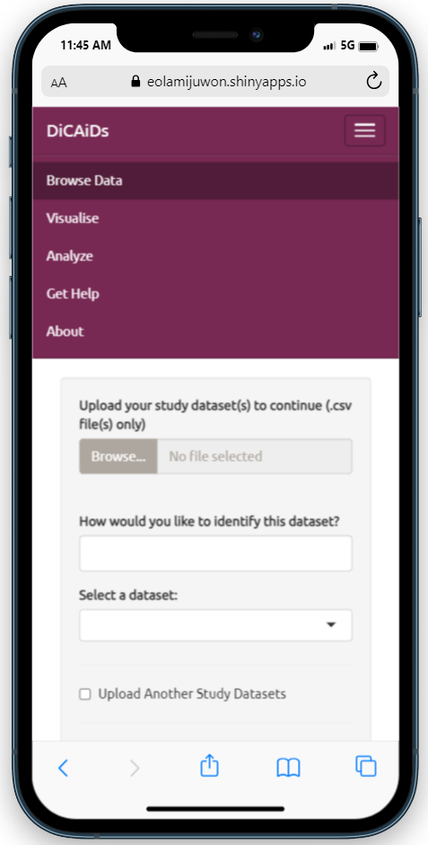
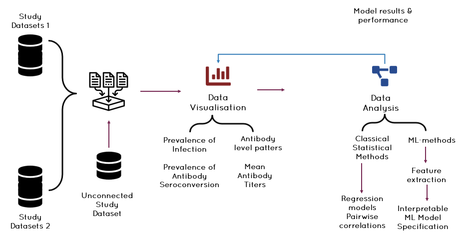
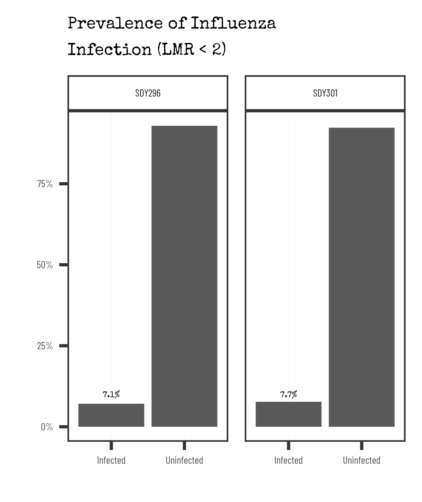
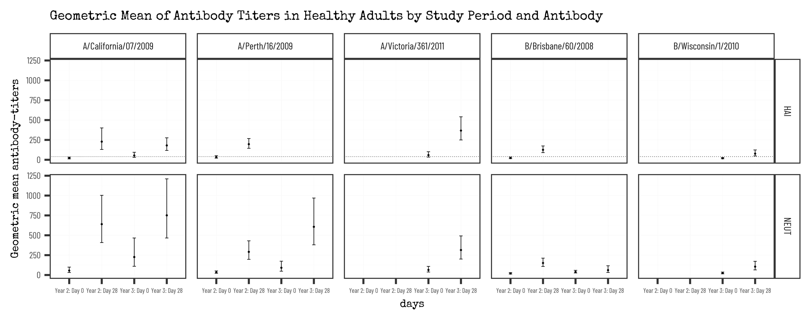
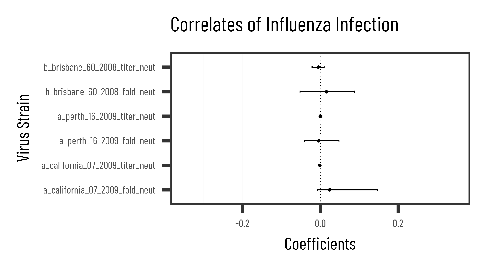

# DiCAIDS {DIgital and Computational Approaches to Infectious Diseases Study}

## Introduction 

The DiCAIDS discovery platform built on the R-shiny framework, provides a user-friendly, click-and-drop interface for aggregating connected datasets, visualising patterns in the dataset and identifying potential correlates of protection.

## The Prototype

The app has five distinctive panels:

- The **Browse Panel** lets users upload, aggregate, process, and explore single/multiple connected study datasets.

- The **Visualise Panel** lets users explore simple descriptive patterns in the datasets, including the prevalence of infection and antibody seroconversion and the geometric mean of antibody titers, among others. Users also have the option to select which assay result and virus strain they want to explore for specific visualisations.

- The **Analyse Panel** lets users apply classical statistical or machine learning methods to identify immune correlates of protection. We also created three separate sub-panels, building on the framework for assessing the immunological correlates of protection in vaccine trials by Qin et al.5. 

- The **Help and About panels** under development are intended to provide additional resources about statistical models, assumptions underpinning all analyses covered on the platform. We will also use this panel to continually engage with the health data science community and other relevant stakeholders to refine the platform, our models, assumptions, and strategies.

## Methodology

Our analytical strategy involves preprocessing uploaded study datasets, visualising patterns in the dataset and exploring the correlates of protection. The analytical steps are described in the screenshot below but also includes our plans for future work.

## Reproducibility Logic

#### **How to replicate the analysis**

-   Download the analysis pack or fork this repository.

-   Using RStudio open `"DiCAIDS.Rproj"` file in the main project directory.

-   Run the `"R/00_master.R"` file which runs all analysis scripts in the `code` folder. 

    Wait. That's it. 

-   Data visualisations (final results) from the scripts are saved in results

-   Data outputs generated from the scripts are saved in `data/output`

## Preliminary Results

-   The prevalence of infection is quite low in our sample (~7%).

    

-   We found significant differences in the geometric mean antibody titer for most virus strains and assay test.

    

-   We did not find any significant relationship between the levels of antibody titers (for hemagglutination inhibition assay (HAI) and neutralising antibody) and the risk of infection in healthy adults.

    

#### **How to run web-application**

-   Using RStudio open "app.Rproj" file in the `results\app` project directory.

-   Run the "ui.R" file which loads a shiny web application.

-   Note: You may need to be connected to the internet to load googleFonts.

## Team

-   [**Dr. Emmanuel Olamijuwon**](https:e.olamijuwon.com)

-   [**Dr. Kehinde Arulaeba**](https://le.ac.uk/people/kehinde-aruleba)

-   **Dr. Adeniyi Francis Fagbamigbe**

